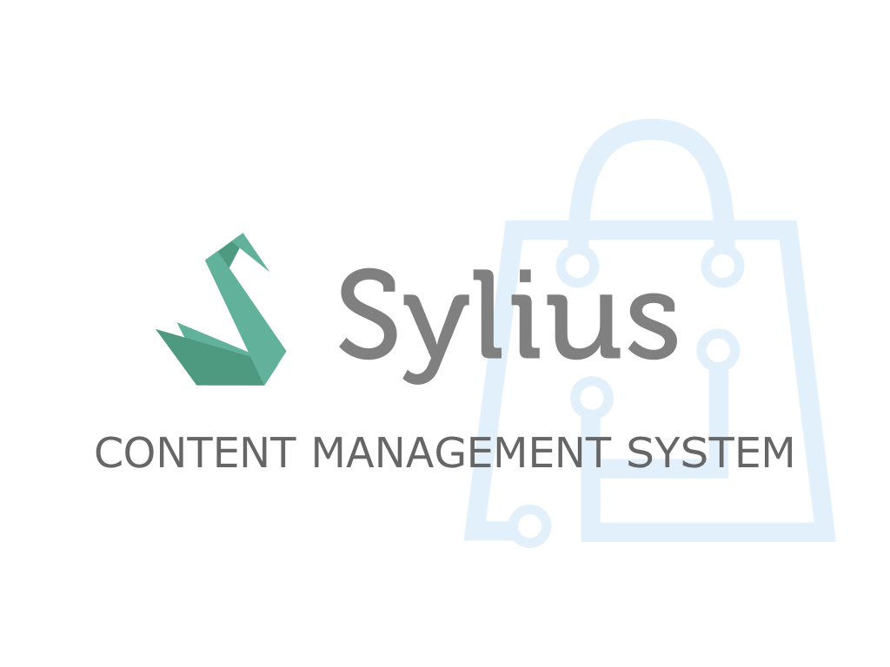

<h1 align="center">
    <a href="http://bitbag.shop" target="_blank">
        
    </a>
<<<<<<< HEAD
    <br />
    <a href="https://packagist.org/packages/bitbag/cms-plugin" title="License" target="_blank">
        
    </a>
    <a href="https://packagist.org/packages/bitbag/cms-plugin" title="Version" target="_blank">
        
    </a>
    <a href="http://travis-ci.org/BitBagCommerce/SyliusCmsPlugin" title="Build status" target="_blank">
        
    </a>
    <a href="https://scrutinizer-ci.com/g/BitBagCommerce/SyliusCmsPlugin/" title="Scrutinizer" target="_blank">
        
    </a>
    <a href="https://packagist.org/packages/bitbag/cms-plugin" title="Total Downloads" target="_blank">
        
    </a>
</h1>
=======
</p>

<h1 align="center">Plugin Skeleton</h1>

<p align="center">Skeleton for starting Sylius plugins.</p>

## Installation

1. Run `composer create-project sylius/plugin-skeleton ProjectName`.

2. From the plugin skeleton root directory, run the following commands:

    ```bash
    $ (cd tests/Application && yarn install)
    $ (cd tests/Application && yarn build)
    $ (cd tests/Application && bin/console assets:install public -e test)
    
    $ (cd tests/Application && bin/console doctrine:database:create -e test)
    $ (cd tests/Application && bin/console doctrine:schema:create -e test)
    ```
>>>>>>> c08494520e1bd10bdf10b8bddc8029d4f7d63938

# BitBagSyliusCmsPlugin

Almost each eCommerce app has to present some content. Managing it is often done via third-party libraries 
like Wordpress, eZ Platform or a built-in content management system. As Sylius does not have a CMS in the 
standard platform, we decided to develop our own which will be as flexible as Sylius. This plugin allows 
you to add dynamic blocks with images, text or HTML to your storefront as well as pages and FAQs section.

## Support

<<<<<<< HEAD
You can order our support on [this page](https://bitbag.shop/products/sylius-content-management-system).
=======
    ```bash
    $ vendor/bin/phpunit
    ```
>>>>>>> c08494520e1bd10bdf10b8bddc8029d4f7d63938

We work on amazing eCommerce projects on top of Sylius and Pimcore. Need some help or additional resources for a project?
Write us an email on mikolaj.krol@bitbag.pl or visit [our website](https://bitbag.shop/)! :rocket:

<<<<<<< HEAD
## Demo
=======
    ```bash
    $ vendor/bin/phpspec run
    ```
>>>>>>> c08494520e1bd10bdf10b8bddc8029d4f7d63938

We created a demo app with some useful use-cases of the plugin! Visit [demo.bitbag.shop](https://demo.bitbag.shop) to take a look at it. 
The admin can be accessed under [demo.bitbag.shop/admin](https://demo.bitbag.shop/admin) link and `sylius: sylius` credentials.

<<<<<<< HEAD
We also recorded a webinar which presents most of the plugin features, including how they have been implemented and specific use-cases.

<div align="center">
    
[](https://www.youtube.com/watch?v=Nk8fKA48t_Y)
=======
    ```bash
    $ vendor/bin/behat --tags="~@javascript"
    ```

  - Behat (JS scenarios)
 
    1. Download [Chromedriver](https://sites.google.com/a/chromium.org/chromedriver/)
    
    2. Download [Selenium Standalone Server](https://www.seleniumhq.org/download/).
    
    2. Run Selenium server with previously downloaded Chromedriver:
    
        ```bash
        $ java -Dwebdriver.chrome.driver=chromedriver -jar selenium-server-standalone.jar
        ```
        
    3. Run test application's webserver on `localhost:8080`:
    
        ```bash
        $ (cd tests/Application && bin/console server:run localhost:8080 -d public -e test)
        ```
    
    4. Run Behat:
    
        ```bash
        $ vendor/bin/behat --tags="@javascript"
        ```
>>>>>>> c08494520e1bd10bdf10b8bddc8029d4f7d63938

</div>

## Documentation

<<<<<<< HEAD
- [Installation](doc/installation.md)
- [Upgrading](UPGRADE.md)
- [Blocks](doc/blocks.md)
- [Pages](doc/pages.md)
- [Sections](doc/sections.md)
- [Media](doc/media.md)
- [FAQs](doc/faqs.md)
- [Fixtures](doc/fixtures.md)
- [WYSIWYG](doc/wysiwyg.md)
- [Importing resources](doc/importing-resources.md)
- [Using Twig functions in the admin panel](doc/twig-functions-in-admin.md)
- [Sitemap](doc/sitemap.md)
- [Customization](doc/customization.md)

## Contribution

Learn more about our contribution workflow on http://docs.sylius.org/en/latest/contributing/. 
=======
    ```bash
    $ (cd tests/Application && bin/console sylius:fixtures:load -e test)
    $ (cd tests/Application && bin/console server:run -d public -e test)
    ```
    
- Using `dev` environment:

    ```bash
    $ (cd tests/Application && bin/console sylius:fixtures:load -e dev)
    $ (cd tests/Application && bin/console server:run -d public -e dev)
    ```
>>>>>>> c08494520e1bd10bdf10b8bddc8029d4f7d63938
