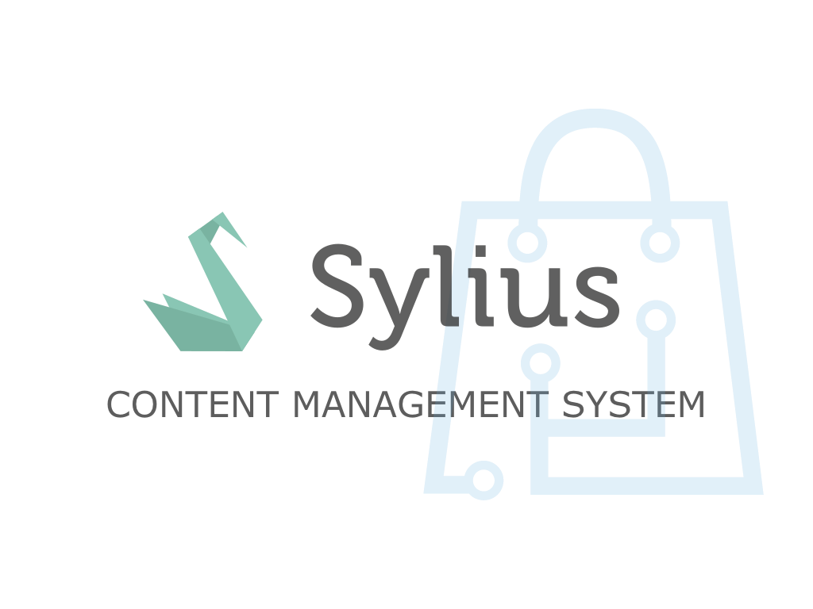

<h1 align="center">
    
     
    
    
    
    
    
    

        
    

</h1>

## About us

At BitBag we do believe in open source. However, we are able to do it just because of our awesome clients, who are kind enough to share some parts of our work with the community. Therefore, if you feel like there is a possibility for us working together, feel free to reach us out. You will find out more about our professional services, technologies and contact details at https://bitbag.io/.

## BitBag SyliusCmsPlugin

Almost each eCommerce app has to present some content. Managing it is often done via third-party libraries 
like Wordpress, eZ Platform or a built-in content management system. As Sylius does not have a CMS in the 
standard platform, we decided to develop our own which will be as flexible as Sylius. This plugin allows 
you to add dynamic blocks with images, text or HTML to your storefront as well as pages and FAQs section.

## Demo

We created a demo app with some useful use-cases of the plugin! Visit [demo.bitbag.shop](https://demo.bitbag.shop) to take a look at it. 
The admin can be accessed under [demo.bitbag.shop/admin](https://demo.bitbag.shop/admin) link and `sylius: sylius` credentials.

We also recorded a webinar which presents most of the plugin features, including how they have been implemented and specific use-cases.

    

## Documentation

- [Installation](doc/installation.md)
- [Upgrading](UPGRADE.md)
- [Blocks](doc/blocks.md)
- [Pages](doc/pages.md)
- [Sections](doc/sections.md)
- [Media](doc/media.md)
- [FAQs](doc/faqs.md)
- [Fixtures](doc/fixtures.md)
- [WYSIWYG](doc/wysiwyg.md)
- [Importing resources](doc/importing-resources.md)
- [Using Twig functions in the admin panel](doc/twig-functions-in-admin.md)
- [Sitemap](doc/sitemap.md)
- [Customization](doc/customization.md)

## Contribution

Learn more about our contribution workflow on http://docs.sylius.org/en/latest/contributing/.
xxx test change to trigger github action
