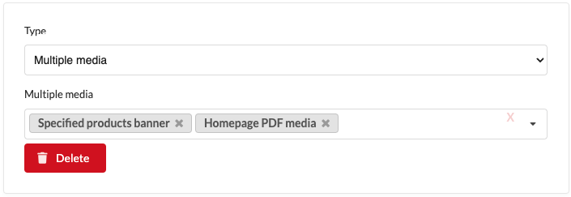
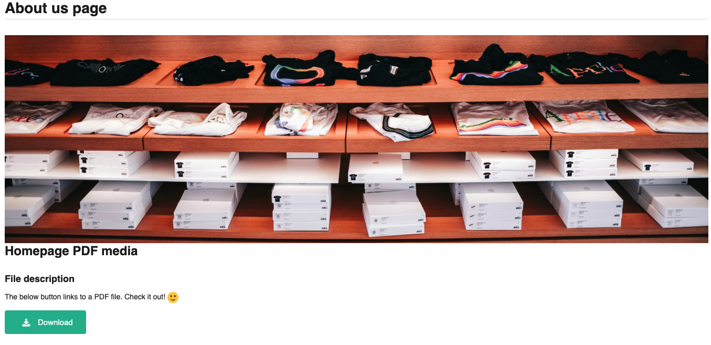

# Multiple media content element

Multiple media content element allows you to add multiple media (images, videos, or files)
from the media library to your block or page.

## View in admin panel

## View in front page

