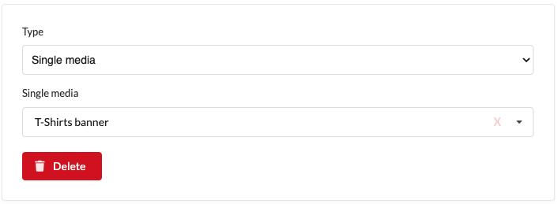

# Single media content element

Single media content element allows you to add a single media (image, video, or file)
from the media library to your block or page.

## View in admin panel

## View in front page

