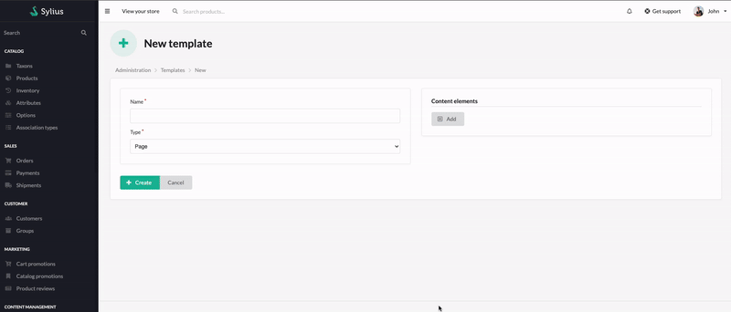

# Content Templates

Content Templates are a way to define the structure of content elements, which can be used in blocks and pages.

## General usage

Let's assume you want to create a content template for a blog post.
You want to add following content elements:
- **Title** (textarea)
- **Subtitle** (textarea)
- **Image** (single media)
- **Content** (textarea)
- **Author** (textarea)
- **Products carousel** (products carousel by taxon)

Then, when you create a page, in the content elements section you can choose the content template you created.
It will create a form with fields you defined in the template. \
Your job is just to fill them with content. \
Of course, you can add additional content elements to the form, after you choose the template. It's super flexible!
