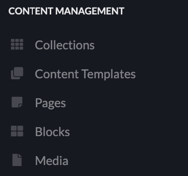
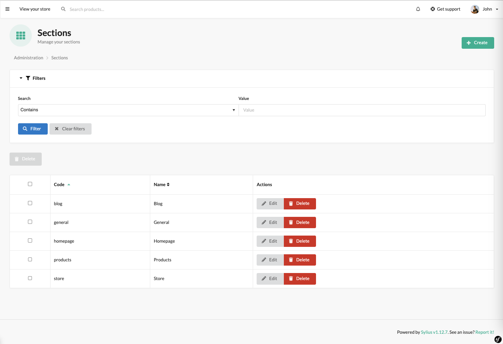
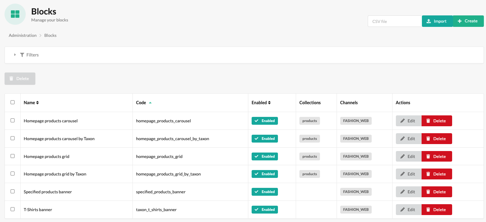
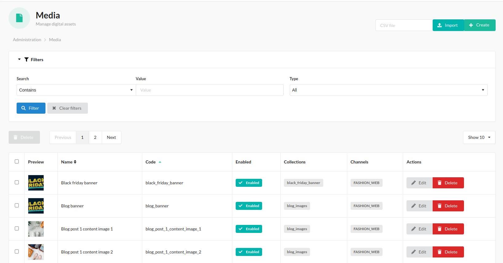
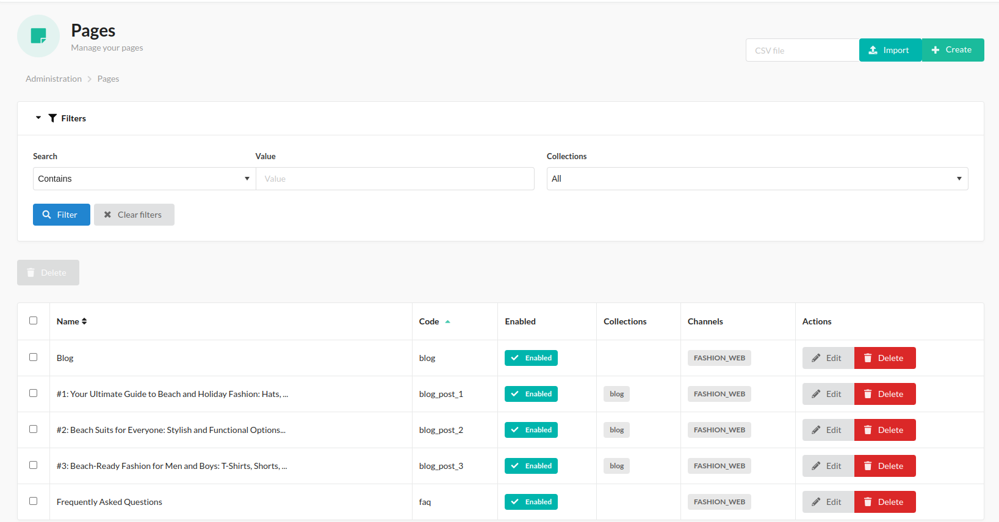

# What is and how to use Sylius CMS Plugin

BitBag Sylius CMS Plugin is a plugin developed for Sylius, 
a popular open-source e-commerce system based on Symfony. 
The plugin enhances Sylius with advanced content management capabilities, allowing the creation,
editing, and publication of dynamic CMS (Content Management System) pages within an e-commerce store.

As e-commerce continues to evolve, businesses are seeking flexible and user-friendly tools to manage content on their websites.
Sylius CMS Plugin addresses this need by providing administrators with the ability to create and edit various types of CMS pages,
such as the homepage, informational pages, blogs, static pages, and more. 
This empowers businesses to easily adapt their store's content to meet current needs and marketing strategies.

## What Sylius CMS Plugin provides us with

When using the BitBag Sylius CMS Plugin, administrators gain access to various tiles within the admin panel, each serving a specific purpose.
These tiles include Blocks, Media, Pages, and Sections.

## Brief overview of what each tile offers

In admin panel, the whole CMS functionality is located under "Content Management" left menu section:

Our CMS Plugin allows you to manage:

* Sections - the containers for blocks
* Blocks - separate parts for the content
* Media - files, that can be attached to the page
* Pages - whole pages, obtainable by the link

---

### Sections: 
The Sections tile allows administrators to create and manage sections within CMS pages.

Sections serve as containers for content blocks and provide a structured way to organize content.
By utilizing sections, administrators can easily arrange and customize the layout of CMS pages to achieve the desired visual and informational structure.

More information about Sections you can get [here](use_case_sections.md).

### Blocks
The Blocks tile allows administrators to create and manage reusable content blocks.

The Blocks can be utilized across different CMS pages, providing flexibility and consistency in content presentation. Blocks can contain text, images, videos, or any other desired content elements.

More information about Blocks you can get [here](use_case_blocks.md).

### Media
The Media tile provides a centralized hub for managing media files within the CMS.

Administrators can upload and organize images, videos, and other media assets. The files can then be easily inserted into CMS pages, enriching the content with visual elements.

More information about Media you can get [here](use_case_media.md).

### Pages:
The Pages tile is where administrators can create, edit, and organize CMS pages.

It enables the creation of various types of pages, such as the homepage, informational pages, or blog posts. Administrators can add content, images, and other media, customize the layout, and manage page hierarchy.

More information about Pages you can get [here](use_case_pages.md).

## Summary

In summary, the BitBag Sylius CMS Plugin provides administrators with a range of tiles in the admin panel, including [Sections](use_case_sections.md), [Blocks](use_case_blocks.md),
[Media](use_case_media.md), [Pages](use_case_pages.md).

These tiles offer functionalities for managing reusable content blocks, media assets, CMS pages and page sections. 
Together, they enable administrators to efficiently create, edit, and organize content within the Sylius e-commerce system,
resulting in a more engaging and personalized user experience.
