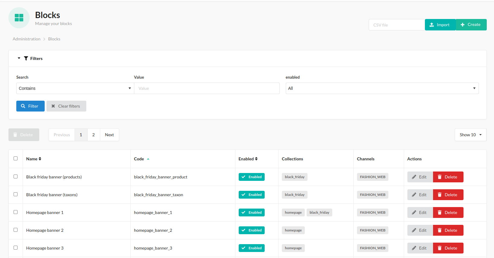

# What is and how to use Sylius CMS Plugin

BitBag Sylius CMS Plugin is a plugin developed for Sylius, 
a popular open-source e-commerce system based on Symfony. 
The plugin enhances Sylius with advanced content management capabilities, allowing the creation,
editing, and publication of dynamic CMS (Content Management System) pages within an e-commerce store.

As e-commerce continues to evolve, businesses are seeking flexible and user-friendly tools to manage content on their websites.
Sylius CMS Plugin addresses this need by providing administrators with the ability to create and edit various types of CMS pages,
such as the homepage, informational pages, blogs, static pages, and more. 
This empowers businesses to easily adapt their store's content to meet current needs and marketing strategies.

## What Sylius CMS Plugin provides us with

When using the BitBag Sylius CMS Plugin, administrators gain access to various tiles within the admin panel, each serving a specific purpose.
These tiles include Collections, Templates, Pages, Blocks and Media.

## Brief overview of what each tile offers

In admin panel, the whole CMS functionality is located under "Content Management" left menu section:

Our CMS Plugin allows you to manage:

* **Collections** - responsible for grouping the pages/blocks/media
* **Templates** - allows to create a template of content elements for the page or block
* **Pages** - whole pages, obtainable by the link
* **Blocks** - separate parts for the content, composed of the content elements
* **Media** - images, videos, etc. that can be used in other segments of the CMS

---

### Collections: 

The Collections tile allows administrators to create and manage collections within CMS pages.

Collections serve as containers for blocks, pages, media and provide a structured way to organize content.
By utilizing collections, administrators can group related content elements together, such as blog posts, product listings, or promotional banners.

More information about Collections you can get [here](use_case_collections.md).

### Templates:

The Templates tile allows administrators to create and manage templates built from content elements skeletons.

### Pages:

The Pages tile is where administrators can create, edit, and organize CMS pages.

It enables the creation of various types of pages, such as the homepage, informational pages, or blog posts.

More information about Pages you can get [here](use_case_pages.md).

### Blocks

The Blocks tile allows administrators to create and manage blocks built from content elements.

The Blocks can be rendered in twig templates, providing flexibility and consistency in content presentation.

More information about Blocks you can get [here](use_case_blocks.md).

### Media

The Media tile provides a centralized hub for managing media files within the CMS.

Administrators can upload and organize images, videos, and other media assets. The files can then be easily used in other parts of the CMS.

More information about Media you can get [here](use_case_media.md).

## Summary

In summary, the BitBag Sylius CMS Plugin provides administrators with a range of tiles in the admin panel, 
including [Collections](use_case_collections.md), [Templates](use_case_templates.md), [Pages](use_case_pages.md), [Blocks](use_case_blocks.md), [Media](use_case_media.md).

These tiles offer functionalities for managing CMS segments. 
Together, they enable administrators to efficiently create, edit, and organize content within the Sylius e-commerce system,
resulting in a more engaging and personalized user experience.
