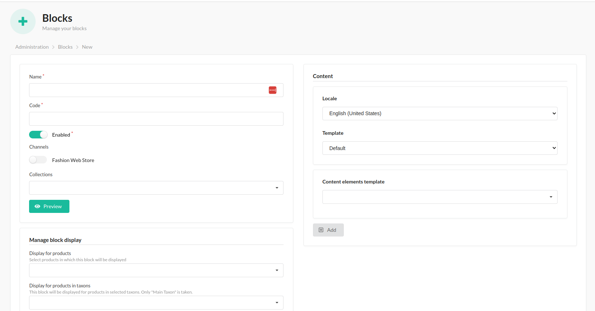

# Blocks

With the BitBag SyliusCmsPlugin, administrators can arrange content blocks within sections, including the product page.
This allows for customized content presentation, showcasing product features, promotions, and relevant information.
The plugin provides flexibility in organizing and managing blocks,
empowering administrators to create an engaging browsing experience tailored to each page's context.
By leveraging this feature, administrators can effectively communicate product details, enhance cross-selling opportunities,
and provide valuable information to customers. Overall,
the plugin enables targeted and contextual content delivery across various pages.

## Creation on the admin page:
### If you haven't implemented the section properly in your code yet, click here [Blocks](blocks.md)

#### The process of creating a block:

- Access the administrator panel of the Sylius e-commerce system.
- Navigate to the CMS section or the designated area for managing blocks.
- Locate the option to create a new block and click on it.
- Fill in the required fields in the block creation form, such as the code and content of the block.
- Save the block after filling in the necessary details and selecting any desired associations.
- Repeat the process to add additional blocks, as needed.
- After refreshing the store page, the newly implemented changes should now be visible.
 
By following these steps, administrators can easily add blocks and customize their associations with products, sections, and taxonomies. This allows for targeted block placement and display on relevant pages, enhancing the overall content management capabilities and user experience.

## Optional: In the form, you will find fields for "Products", "Sections" and "Taxons."
- "Products": Here, you can select specific products that are associated with the block. This allows the block to be displayed on the product pages of the selected products.
- "Sections": You can choose the sections where the block should be placed. This helps in organizing and structuring the block within the relevant sections of the website.
- "Taxons": This field allows you to select specific taxonomies or categories associated with the block. By choosing relevant taxons, the block can be displayed on the pages related to those categories.

## Result on the front of the store:

