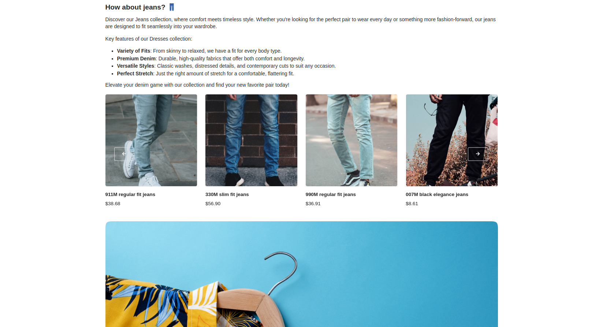

# Blocks

With the BitBag SyliusCmsPlugin, administrators can create and manage blocks built from content elements.

This allows for customized content presentation, showcasing product features, promotions, and relevant information.

The plugin provides flexibility in organizing and managing blocks,
empowering administrators to create an engaging browsing experience tailored to each page's context.

By leveraging this feature, administrators can effectively communicate product details, enhance cross-selling opportunities,
and provide valuable information to customers. Overall,
the plugin enables targeted and contextual content delivery across various pages.

**Note.** If you haven't implemented the blocks properly in your code yet, please visit the [Blocks](blocks.md) tech doc.

## The process of creating a Block:

By following the steps below, administrators can easily add blocks and customize their associations with products, sections, and taxonomies. This allows for targeted block placement and display on relevant pages, enhancing the overall content management capabilities and user experience.

1. Please access the administrator panel of the Sylius e-commerce system.
2. Navigate to the CMS section or the designated area for managing blocks.
3. Locate the option to create a new block and click on it.
4. Fill in the required fields in the block creation form, such as the code and name.
5. Save the block after filling in the necessary details and selecting any desired associations.
6. Repeat the process to add additional blocks, as needed.
7. After refreshing the store page, the newly implemented changes should now be visible.

### Optional configuration

In the form, you will find additional fields, which will help you with your e-commerce related content:

- Display for products - You can select specific products that are associated with the block. This allows the block to be displayed on the product pages of the selected products.
- Display for products in taxon - This field allows you to select specific taxon associated with the block. By choosing relevant taxon, the block will be displayed on the product pages related to those taxon. Only "Main Taxon" is taken.
- Display for taxons - This field allows you to select specific taxonomies associated with the block. By choosing relevant taxons, the block can be displayed on the pages related to those taxons.

The mentioned form:

## Result possible to achieve on the front of the store:

The image below presents you a sample result of Block with a content rendered on the product page:

