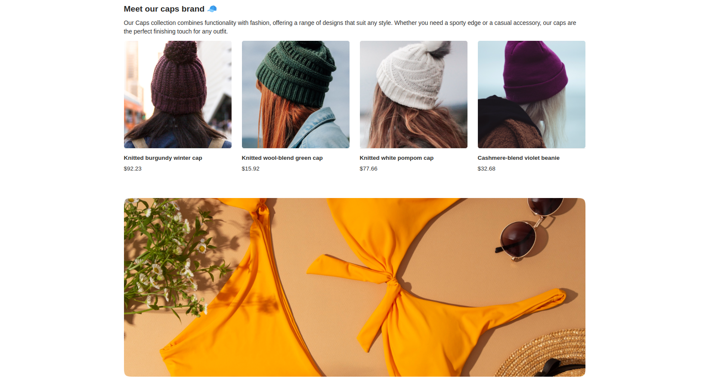

# Collections

With collections, you can organize your blocks, pages and media under specific categories.
For instance, you can create a Blog collection and display pages under it.

Collections in the Sylius CMS Plugin serve as containers where various elements, such as content blocks, CMS pages,
and media, can be placed. These collections allow administrators to organize and manage the layout and presentation of content on pages.

The ability to place blocks, pages, and media within collections provides full control over the appearance and structure of CMS pages,
enabling the creation of visually appealing and cohesive content layouts. Collections offer flexibility in designing pages,
allowing for customization and adaptation of displayed content to user preferences and marketing strategies.

**Note.** If you haven't implemented the collection properly in your code yet, please visit the [Collections](collections.md) tech doc.

## The process of creating a Collection:

By following the steps below, administrators can add collections by providing the code, name and type for each collection. 
These collections can be then utilized within the CMS pages for organizing and structuring content.

1. Please access the administrator panel of the Sylius e-commerce system.
2. Navigate to the CMS section or the designated area for managing collections.
3. Select the option to create a new collection.
4. Fill in the required fields in the collection creation form, such as the code, name and type of the collection.
5. Save the collection after providing the necessary details.
6. Repeat the process to add additional collections, as needed.
7. After refreshing the store page, the newly implemented changes should now be visible.

The mentioned form:

## Result possible to achieve on the front of the store:

It's possible to attach [Blocks](use_case_blocks.md), [Media](use_case_media.md) and [Pages](use_case_pages.md) to the Collections. This makes you able to [display all](collections.md) the content attached to the single Collection.

The image below presents you a sample result of Collection rendered on the product page:

