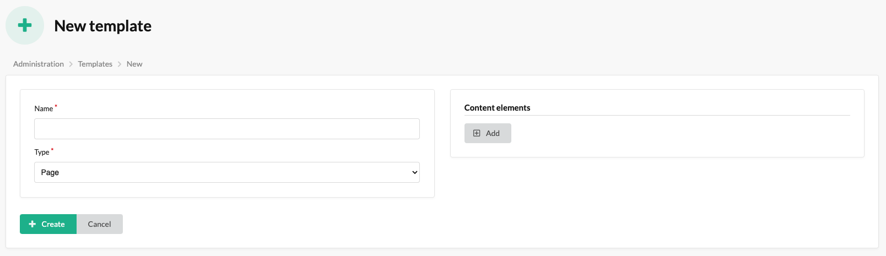

# Content Templates

In this plugin, content templates are responsible for defining the structure of content elements, which can be used in blocks and pages.

## The process of creating a Content Template

By following these steps below, administrators can easily add and manage content templates.

1. Please access the administrator panel of the Sylius e-commerce system.
2. Navigate to the CMS section or the designated area for managing content templates.
3. Select the option to create a new content template item.
4. Fill in the required fields in the content template creation form, such as the name and type.
5. Add some content elements.
6. Save the content template item after filling in the necessary details.
7. Repeat the process to add additional content template items, as needed.
8. Now you can use content templates in blocks and pages.

The mentioned form:

