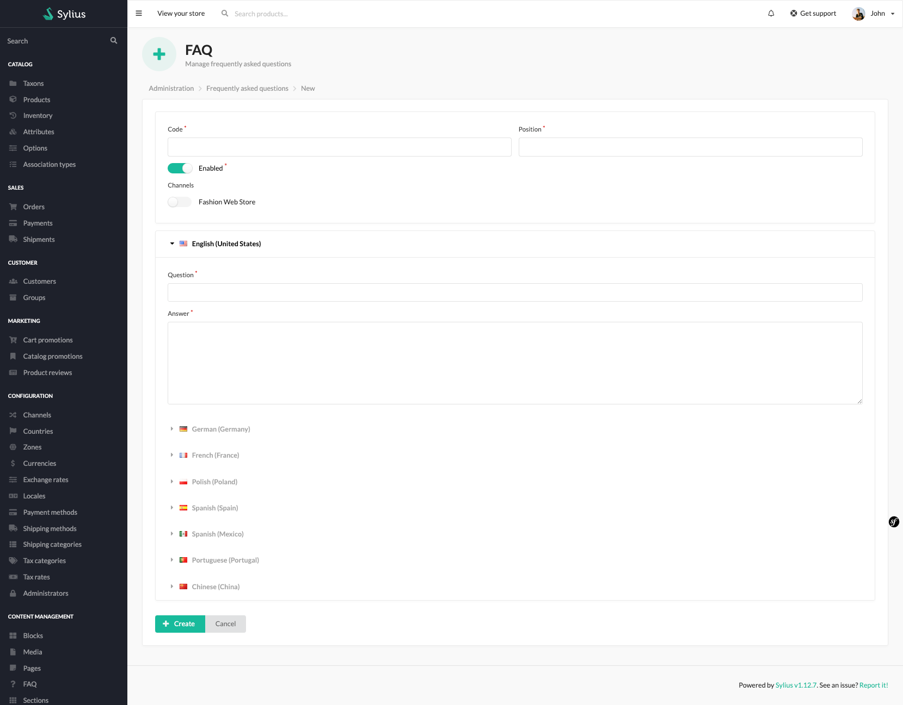
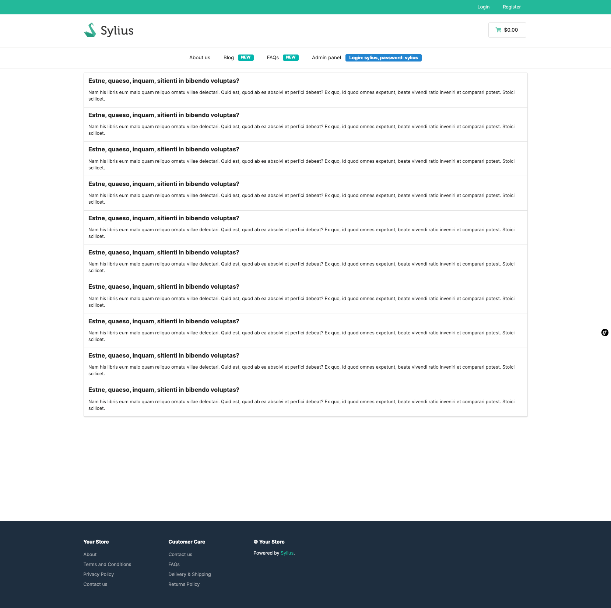

# FAQ

Frequently asked question is a common part of each eCommerce website. You can add the in your admin
panel configuring question, answer and position. All results will be paginated in the store front.

The BitBag SyliusCmsPlugin allows administrators to add and display questions and answers within the FAQ section on various pages, including the product page.
This feature enables the easy management and presentation of frequently asked questions, providing valuable information to customers within a dedicated FAQ section.

Creation on the admin page:

Result on the front of the store:

