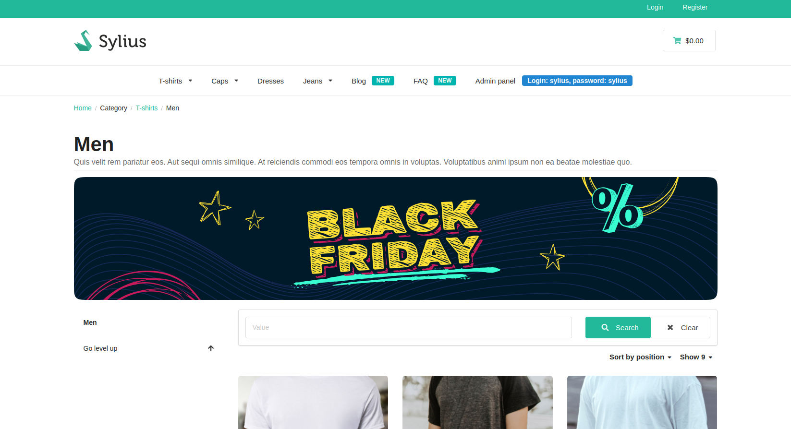

# Media

In this plugin media represents a digital assets, for instance an image, a video or simple PDF file. The BitBag SyliusCmsPlugin enables administrators to add and display various types of media, such as images,
videos, and files, in desired locations throughout the website.
This functionality allows for seamless integration of media elements using HTML tags,
providing a visually engaging experience for users.

Currently, it supports following media types:

- Image (img HTML tag)
- Video (video HTML tag)
- File (a HTML tag)

Creation on the admin page:

Result on the front of the store:

