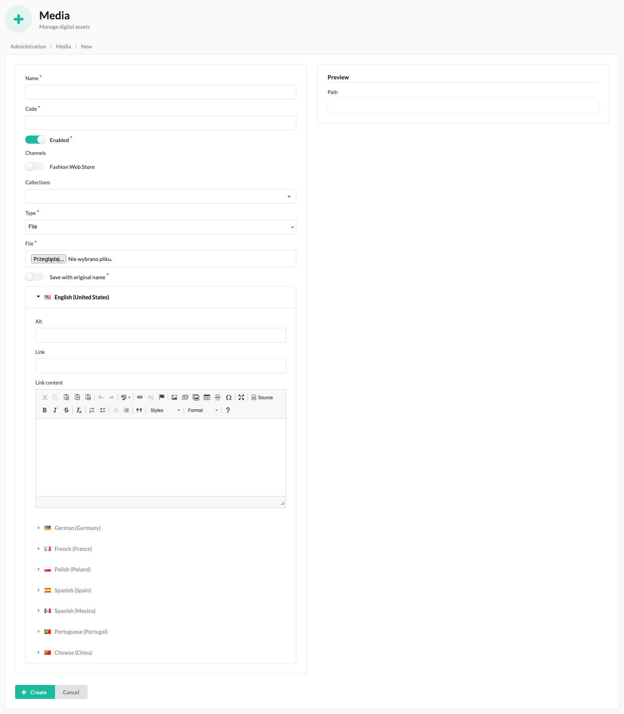

# Media

In this plugin, media represents digital assets, for instance, an image, a video, or a simple PDF file.

The Sylius CMS Plugin enables administrators to add and display various types of media, such as images, videos, and files, in desired locations throughout the website.

This functionality allows for the seamless integration of media elements using HTML tags, providing a visually engaging experience for users.

Currently, it supports the following media types:

- Image (img HTML tag)
- Video (video HTML tag)
- File (a HTML tag)

**Note.** If you haven't implemented the Media properly in your code yet, please visit [Media](media.md) tech doc.

## The process of creating a Media

By following these steps bellow, administrators can easily add and manage media.

1. Please access the administrator panel of the Sylius e-commerce system.
2. Navigate to the CMS section or the designated area for managing media.
3. Select the option to create a new media item.
4. Fill in the required fields in the media creation form, such as the code and uploaded file.
5. Save the media item after filling in the necessary details and selecting any desired associations.
6. Repeat the process to add additional media items, as needed.
7. After refreshing the store page, the newly implemented changes should now be visible.

### Optional configuration

In the form, you will find additional fields, which will help you with your e-commerce related content:

- Collections - You can choose the collections where the media should be placed. This allows for precise positioning and organization of the media within the relevant collections of the website.
- Translations:
    - Alt - The alternative text for the media item.
    - Link - The URL in which the media item should redirect to.
    - Link content - Description of the media item link.

The mentioned form:

## Result possible to achieve on the front of the store:

