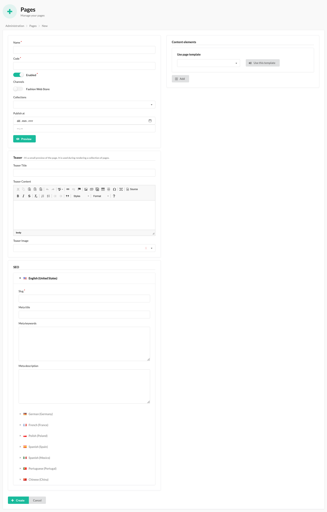
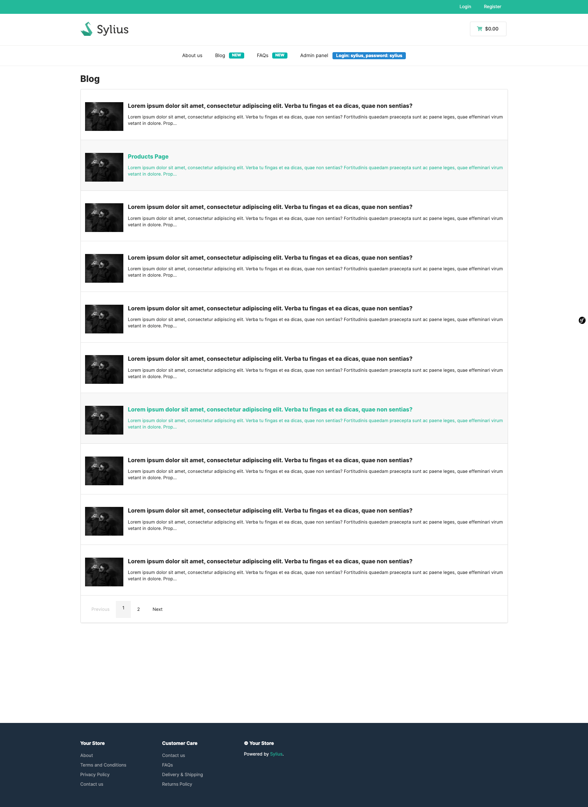
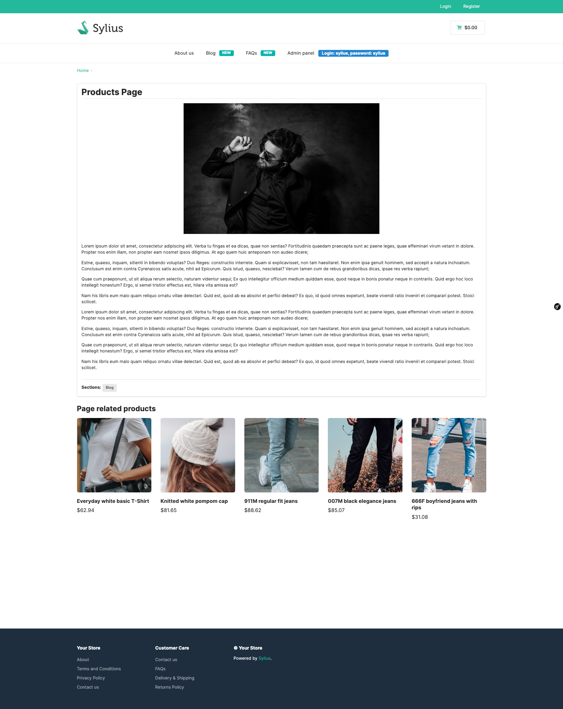

# Pages

Pages represent a customizable web page, you can adjust to your needs in admin panel.

Creation on the admin page:

Result on the front of the store:

With the Bitbag SyliusCmsPlugin, administrators can associate related products with CMS pages, displaying them in the designated section.
This feature allows for targeted product recommendations and cross-selling opportunities within the content.
Additionally, administrators can incorporate media elements, such as images and videos, into the pages,
enriching the visual presentation and engaging users. 
The flexibility of the plugin empowers administrators to create compelling CMS pages that seamlessly integrate product 
information and multimedia content, enhancing the overall user experience.
