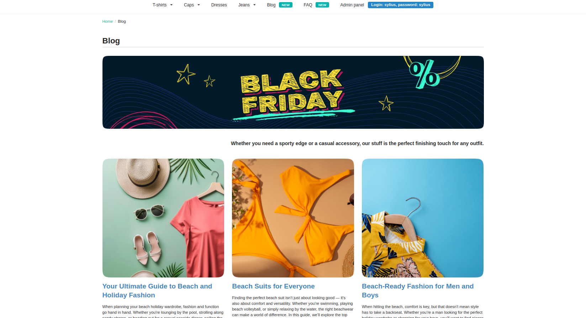
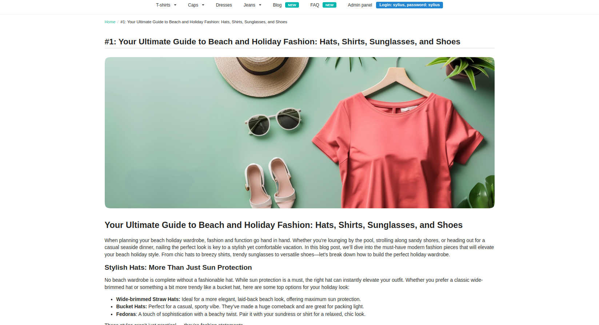

# Pages

Pages represent a customizable web page, you can adjust them to your needs in the admin panel.

With the Sylius CMS Plugin, administrators can create page content using content elements section.

Additionally, administrators can set teaser image, title and content to be displayed on the pages collection listing.

The flexibility of the plugin empowers administrators to create compelling CMS pages that seamlessly integrate product
information and multimedia content, enhancing the overall user experience.

**Note.** If you haven't implemented the Pages properly in your code yet, please visit [Pages](pages.md) tech doc.

## The process of creating a Page

By following the steps below, administrators can add pages.

1. Please access the administrator panel of the Sylius e-commerce system.
2. Navigate to the CMS section or the designated area for managing pages.
3. Select the option to create a new page.
4. Fill in the required fields in the page creation form, such as the name, code and slug.
5. Save the page after filling in the necessary details.
6. Repeat the process to add additional pages, as needed.
7. After refreshing the store page, the newly implemented changes should now be visible.

### Additional configuration

In the form, you can also set SEO settings for the page:
- Meta title
- Meta keywords
- Meta description

Additionally, you can set the page teaser image, title and content to be displayed on the pages collection listing.

The mentioned form:

## Result possible to achieve on the front of the store:

The image below displays a simple Blog page with listing of posts:

The image below displays a simple Blog post:

