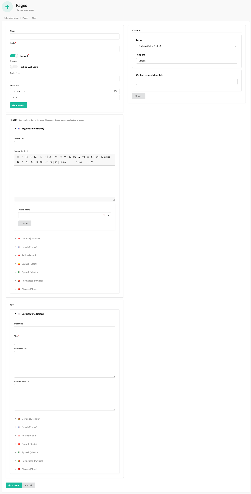

# Pages

Pages represent a customizable web page, you can adjust to your needs in admin panel.

With the BitBag SyliusCmsPlugin, administrators can associate related products with CMS pages, displaying them in the designated section.
This feature allows for targeted product recommendations and cross-selling opportunities within the content.
Additionally, administrators can incorporate media elements, such as images and videos, into the pages,
enriching the visual presentation and engaging users.
The flexibility of the plugin empowers administrators to create compelling CMS pages that seamlessly integrate product
information and multimedia content, enhancing the overall user experience.

## Creation on the admin page:
### If you haven't implemented the pages properly in your code yet, click here [Pages](pages.md)

#### The process of creating page:
- Access the administrator panel of the Sylius e-commerce system.
- Navigate to the CMS section or the designated area for managing pages.
- Select the option to create a new page.
- Fill in the required fields in the page creation form, such as the name, content and slug.
- Save the page after filling in the necessary details and selecting any desired associations.
- Repeat the process to add additional pages, as needed.
- After refreshing the store page, the newly implemented changes should now be visible.

By following these steps, administrators can add pages and associate them with products, allowing the pages to display relevant product information. This integration enhances the browsing experience by providing seamless access to product details directly from the associated pages.

## Optional: In the form, you may find fields for "Products" and "Sections"
- "Products": Here, you can associate specific products with the page. This means that the page will display and provide information related to the selected products.
- "Sections": You can choose the sections where the page should be placed, ensuring proper organization and positioning of the page within the website's structure.

## Result on the front of the store:

