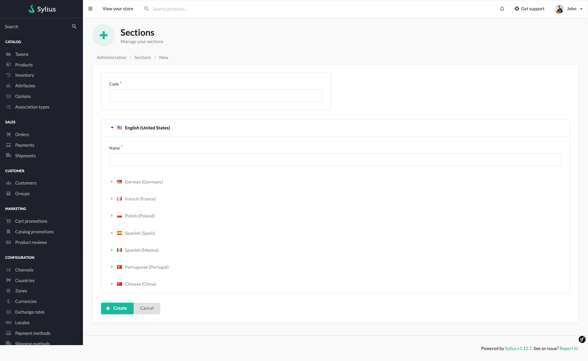
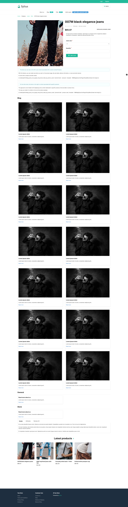

# Sections

With sections, you can organize your blocks and pages under specific categories.
For instance, you can create a Blog section and display pages and blocks under it.

Sections in the BitBag SyliusCmsPlugin serve as containers where various elements, such as content blocks, CMS pages,
and media, can be placed. These sections allow administrators to organize and manage the layout and presentation of content on pages.

The ability to place blocks, pages, and media within sections provides full control over the appearance and structure of CMS pages,
enabling the creation of visually appealing and cohesive content layouts. Sections offer flexibility in designing pages,
allowing for customization and adaptation of displayed content to user preferences and marketing strategies.

**Note.** If you haven't implemented the section properly in your code yet, please visit the [Sections](sections.md) tech doc.

## The process of creating a Section:

By following the steps below, administrators can add sections by providing the code and name for each section. These sections can be then utilized within the CMS pages for organizing and structuring content.

1. Please access the administrator panel of the Sylius e-commerce system.
2. Navigate to the CMS section or the designated area for managing sections.
3. Select the option to create a new section.
4. Fill in the required fields in the section creation form, such as the code and name of the section.
5. Save the section after providing the necessary details.
6. Repeat the process to add additional sections, as needed.
7. After refreshing the store page, the newly implemented changes should now be visible.

The mentioned form:

### Possible to achieve result on the front of the store:

It's possible to attach Blocks, Media and Pages to the Sections. This makes you able to [display all](sections.md) the content attached to the single Section.

The image below presents you a sample result of Section rendered on the product page, to which we attached Pages to get the simple Blog result:

