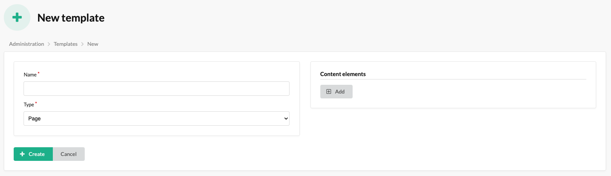

# Templates

In this plugin, templates are responsible for defining the structure of content elements, which can be used in blocks and pages.

## The process of creating a Template

By following these steps below, administrators can easily add and manage templates.

1. Please access the administrator panel of the Sylius e-commerce system.
2. Navigate to the CMS section or the designated area for managing templates.
3. Select the option to create a new template item.
4. Fill in the required fields in the template creation form, such as the name and type.
5. Add some content elements.
6. Save the template item after filling in the necessary details.
7. Repeat the process to add additional template items, as needed.
8. Now you can use templates in blocks and pages.

The mentioned form:

